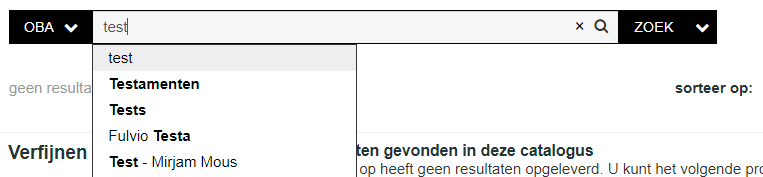
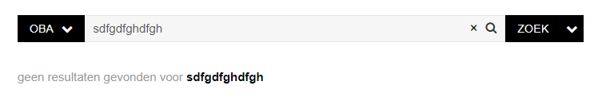
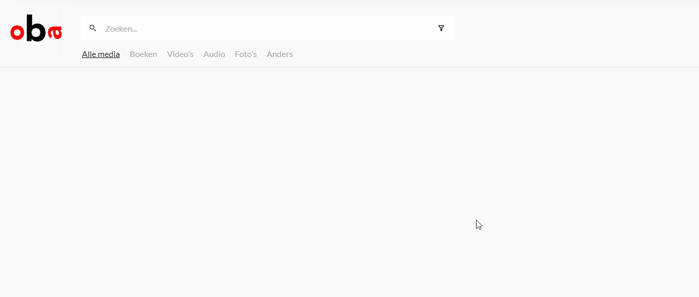

# Project 1 @cmda-minor-web · 2018-2019


[Try out the live demo!](https://maanlamp-oba-project-1.netlify.com/)

<br/>

---

<br/>

## Glossary
<details>
	<summary>Click to expand</summary>

- [Project 1 @cmda-minor-web · 2018-2019](#project-1-cmda-minor-web--2018-2019)
	- [Glossary](#glossary)
	- [Getting started](#getting-started)
	- [Concept](#concept)
		- [Features](#features)
			- [Autocompletion](#autocompletion)
			- [Error feedback](#error-feedback)
			- [Extra suggestions](#extra-suggestions)
		- [Limitations](#limitations)
	- [License](#license)

</details>

<br/>
<br/>
<br/>

## Getting started
To get searching, firstly clone the repo.

Then, install dependencies:
```shell
npm i
```

Then, run some form of a server to host the webapp. I recommend [Live Server](https://marketplace.visualstudio.com/items?itemName=ritwickdey.LiveServer).

<br/>
<br/>

## Concept

This repo contains a webapp built to showcase possible improvements to the autosuggest feature for the OBA. It also searches for items in the database, and allows for more casual browsing through suggested items based on your search, and suggested categories.

I wanted to focus primarily on user experience, secundarily on visual desgin, and only tertiarily on technical stuff. Most of my projects are built exactly the other way around, and I don't think that's a good practise.

<br/>

### Features
The concept is based on a couple of concise but important features.

#### Autocompletion
Autocompletion now not only suggests titles, it gets a coverimage and a short description aswell.


A big difference to the current:


<br/>

#### Error feedback
The webapp tells you if you search for something non-existant:


A big difference to the current:


<br/>

#### Extra suggestions
Whenever you have searched for an item within the OBA catalogue, the app will recommend a few other items based on what you have searched. It will also expose some genres/categories for the user to explore.



<br/>
<br/>

### Limitations
Because of obvious time constraints, I didn't get to do everything I wanted. For example:
- The "Meer zoals dit" panel doesn't actually work. I would have liked it to.
- Search results aren't sorted in any way.
- Autosuggest results aren't sorted either.
- Filtering doesn't work
- Most media types don't have an image because the OBA-api data is super messy.
- I wanted to show several panels like "Staff Picks", or "Meest Geleend" inbetween search results to allow for more casual browsing.

<br/>
<br/>

## License
Licensed under MIT, copyright [@maanlamp](https://github.com/maanlamp)